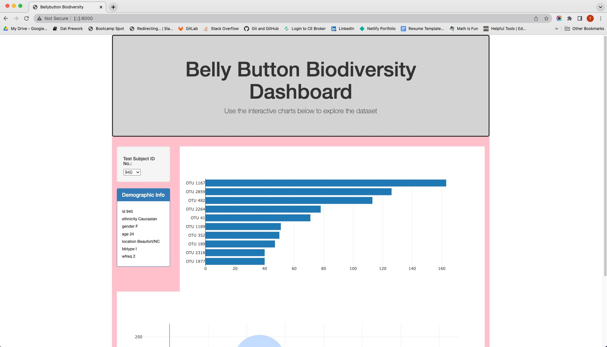
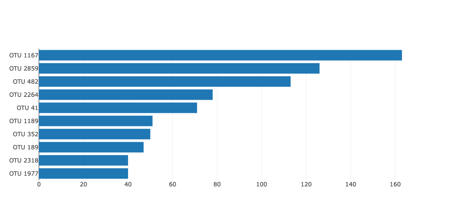
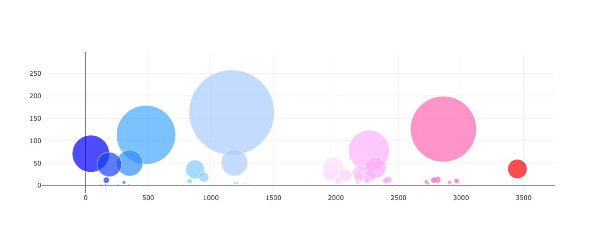

### plotly_challenge
 

# Belly Button Diversity

The challenge was to build an interactive dashboard that explore the [<strong>Belly Button Diversity</strong>](/data/samples.json) dataset. 

## Description

The dataset contains catalogs of microbes that colonize human navals. The catologs reveals that only a small, handful of microbial species (also called operational taxonomic unites or OTUs) were present in more than 70% of people, while the rest were relatively rare.

## Process

Completed the following steps:

1. Used the D3 library to read in `samples.json` from the URL `https://2u-data-curriculum-team.s3.amazonaws.com/dataviz-classroom/v1.1/14-Interactive-Web-Visualizations/02-Homework/samples.json`.

2. Created a horizontal bar chart with a dropdown menu to display the top 10 OTUs found in that individual.

  * Used `sample_values` as the values for the bar chart.

  * Used `otu_ids` as the labels for the bar chart.

  * Used `otu_labels` as the hovertext for the chart.

  

3. Created a bubble chart that displays each sample.

  * Used `otu_ids` for the x values.

  * Used `sample_values` for the y values.

  * Used `sample_values` for the marker size.

  * Used `otu_ids` for the marker colors.

  * Used `otu_labels` for the text values.

4. Displayed the sample metadata, i.e., an individual's demographic information.

5. Displayed each key-value pair from the metadata JSON object somewhere on the page.

6. Updated all the plots when a new sample is selected. 

## References

Hulcr, J. et al. (2012) _A Jungle in There: Bacteria in Belly Buttons are Highly Diverse, but Predictable_. Retrieved from: [http://robdunnlab.com/projects/belly-button-biodiversity/results-and-data/](http://robdunnlab.com/projects/belly-button-biodiversity/results-and-data/)

- - -

© 2022 Trilogy Education Services, a 2U, Inc. brand. All Rights Reserved.

